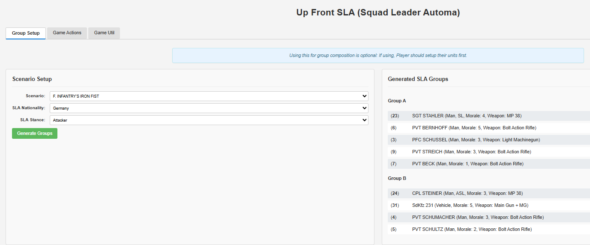
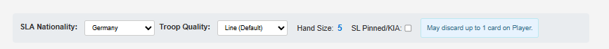
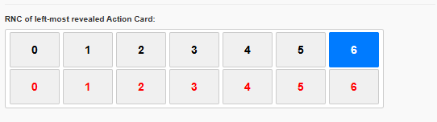
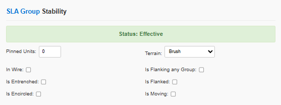
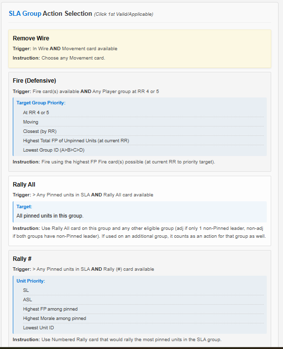
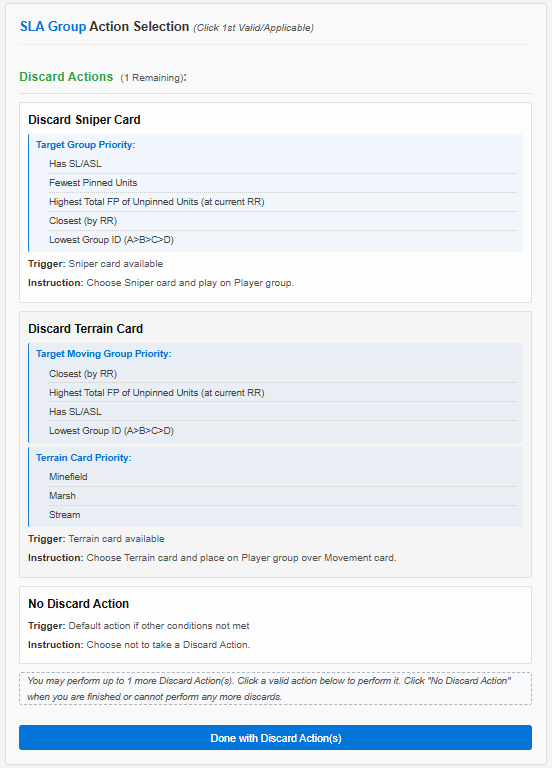
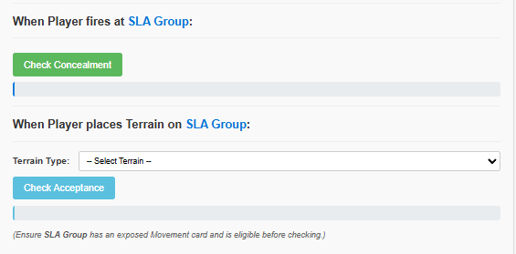
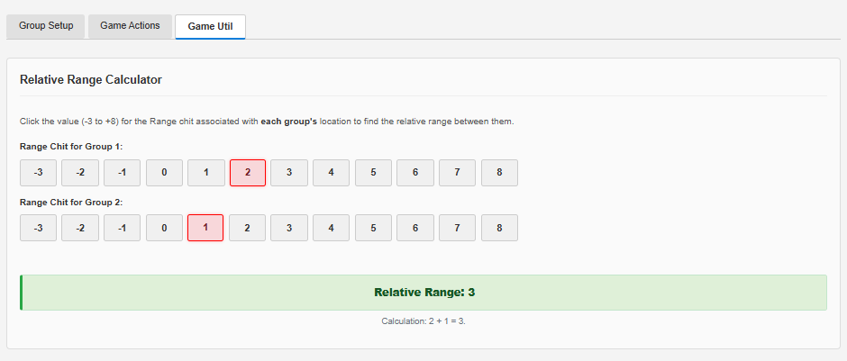

# Up Front SLA (Squad Leader Automa) Web App

Welcome to the Up Front - Squad Leader Automa (SLA) web app! This tool is to help solitaire players of Up Front by providing an AI opponent, automating much of the decision-making process.

## 🚀 Features

*   **Action Determination:** Guides you through group activation, status, and action selection.
*   **Dynamic Priority Lists:** Shows applicable actions for the group based on its current state (Effective/Stressed) and the drawn RNC value.
*   **Discard Phase Management:** Helps track and select discard actions.
*   **Group Setup:** Optionally generate opponent group composition.
*   **Game Utilities:** Includes tools like a Relative Range Calculator.
*   **Data-Driven:** Includes nationality and scenario data.

## 🛠️ Getting Started

*   **Running the App:** Double click the `index.html` file in a web browser (Chrome, Firefox, Edge, Safari). JavaScript must be enabled.

## 🔑 Terms

*   **SLA Group:** A group of personality cards controlled by the automa.

## 📖 How to Use

The app is divided into three main tabs: **Group Setup**, **Game Actions**, and **Game Util**.

### 1. Group Setup Tab (Optional)

This tab helps you generate the initial SLA groups for a scenario. Using this is optional; you can manually set up SLA groups if you prefer.
If you manually setup groups, be sure to select a nationality on the "Game Actions" tab.

*   **Scenario Selection:**
    1.  Choose the **Scenario** you are playing from the dropdown.
    2.  Select the **SLA Nationality** from the dropdown. This will also populate the Nationality on the "Game Actions" tab.
    3.  The **SLA Stance** dropdown will populate with available stances (Attacker/Defender) for the selected Nationality in that Scenario. Choose the appropriate one.
*   Click the **Generate Groups** button.
*   The **Generated SLA Groups** section will display the units assigned to each SLA group (A, B, C, D).

    

### 2. Game Actions Tab

This is the page you'll use during the game to determine SLA actions.

#### A. Initial Setup (Each SLA Turn / Before First SLA Group Activation)

1.  **Global Settings (Top Bar):**
    *   **SLA Nationality:** Select the nationality of the SLA. If you used the "Group Setup" tab, this should already be selected.
    *   **Troop Quality:** Choose the troop quality (Line, Elite, etc.). This affects action priorities. (THIS IS NOT IMPLEMENTED YET)
    *   **Hand Size:** This will display automatically based on nationality and whether the SL is pinned/KIA.
    *   **SL Pinned/KIA:** Check this box if the acting SLA leader (SL or promoted ASL) is Pinned or KIA. This affects hand size and stability.
    *   **Nationality Notes:** Any special notes for the selected nationality will appear here.

    

2.  **SLA Turn and Activation:**
    *   Draw SLA's hand of cards
    *   Use the leftmost card's RPN to determine the acting group, and use its RNC for the action calculations.
    *   **Select the RNC value of this leftmost card** by clicking the corresponding number (Black or Red) in the grid of RNC values.
    *   **When going to the next SLA Group, move the rightmost card to the leftmost position.**

    

3.  **SLA Group Stability Inputs:**
    *   For the **currently acting SLA group**, fill in its status:
        *   **Pinned Units:** Number of pinned units in the group.
        *   **Terrain:** The terrain type the group occupies.
        *   **In Wire, Is Flanking, Is Entrenched, Is Flanked, Is Encircled, Is Moving:** Check applicable boxes.
    *   The **Status Display** (e.g., "Status: Effective", "Status: Stressed") and Action Priority List will update automatically.

    

#### B. SLA Group Action Selection

Once the RNC is selected and stability inputs are set:

1.  **Action Priority List:** The **SLA Group Action Selection** section will display a prioritized list of potential actions.
    *   Each item shows the **Action Type**, **Trigger Conditions**, **Targeting Priority**, and **Instruction**.
2.  **Select Action:** Read down the list. **Click on the *first* valid action** that the SLA group can actually perform given the current game state (cards in hand, available targets, etc.).
3.  **Post-Action Steps:** After clicking an action:
    *   The selected action will be highlighted.
    *   Detailed **"Post-Action Steps (Main Action)"** will appear below it. Follow these steps.
    *   A button **"Done with Main Action(s)"** will appear.  **Only click this after all SLA groups have activated**.
    *   If not done with main actions, go to the next SLA group and repeat this process (input RNC, check boxes, etc).
        Remember to move the rightmost SLA hand card to the leftmost position for the next SLA activation.

    

4.  **Proceed to Discard Phase:** Click **"Done with Main Action(s)"**.

#### C. Discard Action Phase

1.  **Discard Actions Remaining:** How many discard actions the SLA can take (based on nationality) will be shown.
2.  **Discard Priority List:** A list of available discard actions will appear.
    *   **Click on a valid discard action** the SLA can perform, or click **"No Discard Action"** if none are applicable or desired.
3.  **Post-Action Steps:** Similar to main actions, **"Post-Action Steps (Discard Action)"** will appear. Follow them.
4.  **Continue or End:**
    *   If more discard actions are available and one was taken, the button will say **"Choose next Discard Action"**. Click it to refresh the discard list.
    *   If no more discards can be taken, or "No Discard Action" was chosen, the click the **"Done with Discard Action(s)"** button.

    

5.  **End of SLA Group Turn:** After clicking "Done with Discard Action(s)", the section will indicate the SLA group's turn is complete.
    *   Now that all SLA groups have activated, the main SLA turn is over and it is the player's turn.

#### D. Player Interaction with SLA (as needed during gameplay)

*   **When Player fires at SLA Group:**
    *   Click **"Check Concealment"**. (e.g., "No Concealment", "Concealment (-2)") will be displayed.
*   **When Player places Terrain on SLA Group:**
    1.  Select the **Terrain Type** being placed from the dropdown.
    2.  Click **"Check Acceptance"**. Will indicate if the SLA group accepts or refuses the terrain.

    

### 3. Game Util Tab

This tab provides utilities for playing the game (currently only a relative range calculator).

#### Relative Range Calculator

1.  **Input Range Chits:** For two groups (SLA or Player), click the button corresponding to the value on each group's Range Chit (-3 to +8).
2.  **View Result:** The **Relative Range** will be calculated and displayed, along with the formula used.

    

## 💡 Tips

*   **Follow Game Rules:** This app automates SLA decisions but assumes you are following all other "Up Front" game rules regarding movement, combat, card play, etc.
*   **SLA Rules:** The SLA does play slightly differently than the player in that it gets a fresh set of hand cards each turn and discards are slightly different.
*   **Leftmost Card:** Always remember the importance of the leftmost SLA card for RPN (group activation) and RNC (action determination).
*   **Player Discretion:** If anything is ambiguous or isn't handled by this app, use an RNC to decide between options.

---
